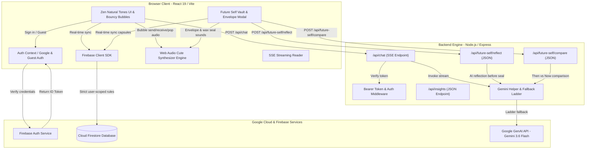
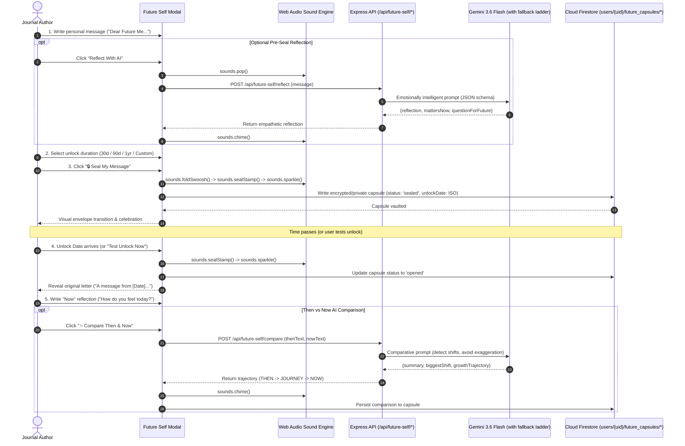
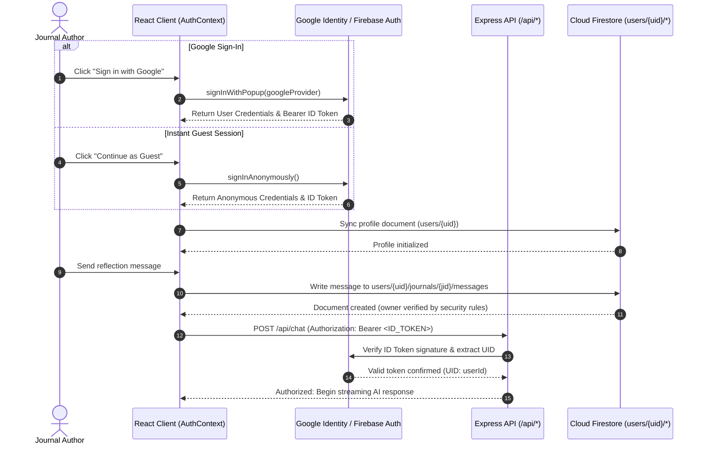
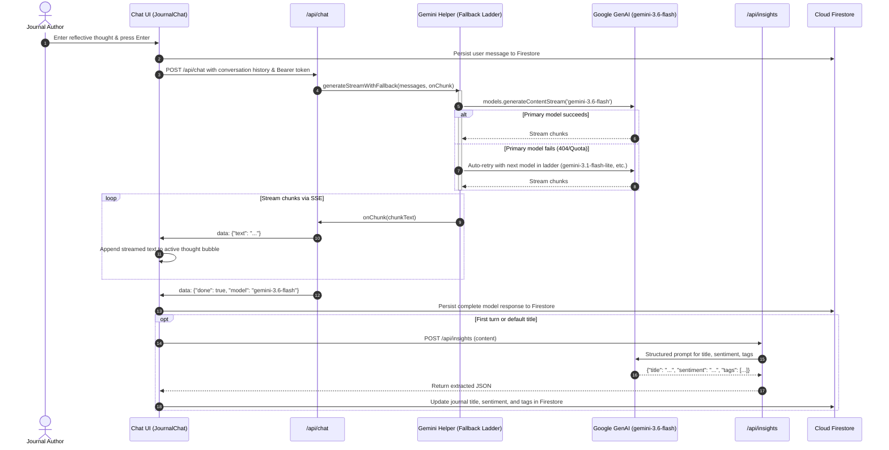
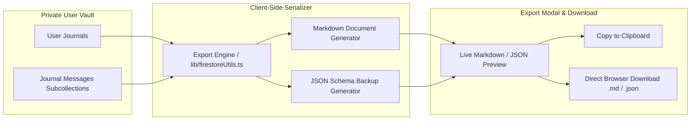

# Loom — Weaving Reflections & Future Self Time Capsule

A private, user-authenticated reflective journaling partner and time capsule vault built with **React 19**, **TypeScript**, **Express**, **Firebase Authentication**, **Cloud Firestore**, and the **Google GenAI SDK (`gemini-3.6-flash`)**. Featuring empathetic Socratic dialogue, "Natural Tones" parchment aesthetic, ambient Zen background motion, cute Web Audio synthesized bubble sounds, interactive mood vibe pickers, message emoji reactions, and the complete **"Future Self"** time capsule lifecycle: *Write → Reflect → Seal → Wait → Open → Compare → Grow*.

---

## 1. System Architecture & Flow Diagrams

### 1.1 High-Level System Architecture



---

### 1.2 Future Self Time Capsule Lifecycle Flow



---

### 1.2 Authentication & User-Isolation Sequence Flow



---

### 1.3 Streaming Socratic Chat & Insights Extraction Flow



---

### 1.4 Data Sovereignty & Backup Export Flow



---

## 2. Project Directory & Repository Guide

```
├── .env.example              # Template documenting all required environment variables
├── README.md                 # Complete system documentation, flows, and testing guide
├── components.json           # Component configuration
├── firebase-applet-config.json # Firebase project identifiers & credentials
├── firestore.rules           # Strict owner-bound Firestore security rules
├── index.html                # HTML entry point with metadata synchronization
├── metadata.json             # App title, description, and capability permissions
├── package.json              # Node.js dependencies and script definitions
├── server.ts                 # Express entry point with Vite middleware & API routes
│
├── server/                   # Backend Server Modules
│   ├── authMiddleware.ts     # Bearer token verification with fallback decoding
│   └── geminiHelper.ts       # GenAI SDK integration with multi-tier fallback ladder
│
├── src/                      # Frontend Source Code
│   ├── App.tsx               # Primary app controller, state orchestrator & modals
│   ├── main.tsx              # React 19 application mount
│   ├── types.ts              # End-to-end TypeScript interfaces & data models
│   ├── index.css             # Tailwind CSS & Zen floating keyframe animations
│   │
│   ├── components/           # Modular Sub-Components
│   │   ├── DeleteModal.tsx   # Irreversible deletion confirmation dialog
│   │   ├── ExportModal.tsx   # Markdown / JSON data export modal with preview
│   │   ├── FutureSelfCard.tsx # Sidebar & inline Future Self capsule banner
│   │   ├── FutureSelfModal.tsx # Full-lifecycle time capsule vault (write, seal, unlock, compare)
│   │   ├── JournalChat.tsx   # Socratic chat stream, bouncy bubbles, mood bar & reactions
│   │   ├── LandingPage.tsx   # Public hero page with Google & Guest authentication
│   │   ├── Sidebar.tsx       # Searchable reflections list, tag filters & user menu
│   │   └── ZenBackground.tsx # Interactive floating leaves, orbs, and click water ripples
│   │
│   ├── context/              # React Context Providers
│   │   └── AuthContext.tsx   # Firebase Auth state, token refresh, and login handlers
│   │
│   └── lib/                  # Utilities & Database Handlers
│       ├── firebase.ts       # Firebase app, auth, and database initialization
│       ├── firestoreUtils.ts # User-scoped CRUD, real-time subscriptions & export logic
│       └── soundEffects.ts   # Web Audio cute bubble synthesizer engine
```

---

## 3. Local Development & Setup Guide

### 3.1 Prerequisites

- **Node.js**: Version `18.x` or `20.x` or higher
- **npm**: Version `9.x` or higher
- **Google Cloud / Gemini API Key**: Obtain a key from [Google AI Studio](https://aistudio.google.com/)

---

### 3.2 Step-by-Step Local Setup

#### Step 1: Clone the Repository
```bash
git clone <your-repository-url>
cd reflective-journal
```

#### Step 2: Install Dependencies
```bash
npm install
```

#### Step 3: Configure Environment Variables
Copy `.env.example` to `.env`:
```bash
cp .env.example .env
```
Edit `.env` to provide your Gemini API key:
```env
# .env
GEMINI_API_KEY="AIzaSyYourActualGeminiApiKeyHere"
FIREBASE_PROJECT_ID="tidal-protocol-j53bd"
APP_URL="http://localhost:3000"
```

> **Note**: In AI Studio, `GEMINI_API_KEY` is securely injected from the Secrets panel at runtime.

#### Step 4: Run the Development Server
```bash
npm run dev
```
The application will boot on `http://localhost:3000`.

---

## 4. How to Test the Application Locally

### 4.1 Testing in the Browser

#### Test Flow 1: Instant Guest Mode (Zero Configuration)
1. Open `http://localhost:3000` in your web browser.
2. In the hero section, click **"Continue as Guest (Instant Access)"**.
3. The app initializes an anonymous Firebase session and immediately routes you to the private journal workspace.
4. Verify that the floating botanical background and subtle concentric ripples are animated.

#### Test Flow 2: Socratic Reflection & Streaming Chat
1. In the input box at the bottom, type:
   > *"I have been struggling to stay consistent with my morning routines."*
2. Press `Enter` or click **Send**.
3. **Verify**:
   - The user message appears with an author badge.
   - The model streams an empathetic Socratic reply in real-time.
   - The status badge shows **"Gemini 3.6 Flash Active"**.
   - After completion, the title in the header automatically updates to an AI-generated synthesis (e.g., *"Cultivating Morning Routine Consistency"*).

#### Test Flow 3: Interactive Zen Water Ripples
1. Click any empty area in the background or margin.
2. An expanding water ripple ring will emanate from your click point and fade out softly.
3. Move your mouse across the screen; observe the subtle parallax shift of background leaves and light orbs.

#### Test Flow 4: Single & Full Vault Export
1. Click the **Export** icon in the header (or **Export All Data (Backup)** in the sidebar).
2. Toggle between **Markdown (.md)** and **JSON (.json)** formats.
3. Test **Copy to Clipboard** and **Download File** to confirm export functionality.

#### Test Flow 5: Deleting a Reflection
1. Click the trash icon in the header or on any reflection card in the sidebar.
2. Confirm the deletion in the modal.
3. Verify that the journal document and its subcollection messages are removed.

#### Test Flow 6: Cute Sound Effects & Sound Toggle
1. Click the sound toggle button in the header (speaker icon). Notice it toggles between enabled (with a green ping indicator) and muted.
2. When typing a message and clicking **Send**, listen for the bouncy ascending water-drop chirp (`bubbleSend`).
3. When the first packet of the AI reply arrives, listen for the two-tone melodic bubble pop (`bubbleReceive`).
4. Tapping reflection starters, mood pills, and water ripples plays gentle bubble pops (`bubblePop`).

#### Test Flow 7: Interactive Mood Picker & Message Reactions
1. In the header bar under the title, click any mood pill (e.g. `🌸 Peaceful`, `🍵 Grounded`, `✨ Inspired`). Notice the sentiment badge and Firestore update in real-time.
2. Hover over any chat bubble; click the emoji reaction drawer (`💖`, `🌱`, `✨`, `🫧`, `🍵`) to pin an animated reaction badge to the bubble with an audible pop.
3. Hover over the partner message and click the **Copy** icon. Notice the button updates to `"Copied! 🫧"` and the text is copied to your clipboard.

#### Test Flow 8: Future Self Time Capsule Vault
1. Click **🔮 Future Self** in the header or the banner in the sidebar.
2. Type a personal message into the letter canvas (*"Dear Future Me..."*).
3. Click **Reflect With AI** to receive an empathetic pre-seal reflection and prompt for the future.
4. Select an unlock duration (e.g., *30 Days*, *90 Days*, *1 Year*, or *Custom Date*).
5. Click **🔒 Seal My Message** to seal the envelope with wax-stamp audio feedback and visual folding animation.
6. To preview without waiting months, click **⚡ Test Unlock Now** to open the capsule, read your past words, write your current reflection, and run **✨ Compare Then & Now** to view your AI growth trajectory.

---

### 4.2 Testing Server API Endpoints via cURL

You can test the backend Express endpoints directly from your terminal while `npm run dev` is running:

#### 1. Health Check Endpoint
```bash
curl -i http://localhost:3000/api/health
```
**Expected Response**:
```json
HTTP/1.1 200 OK
Content-Type: application/json; charset=utf-8

{
  "status": "ok",
  "timestamp": "2026-09-05T18:30:00.000Z",
  "service": "Reflective Journal AI Server"
}
```

#### 2. Streaming Chat Endpoint (`/api/chat`)
```bash
curl -N -X POST http://localhost:3000/api/chat \
  -H "Content-Type: application/json" \
  -H "Authorization: Bearer demo-token" \
  -d '{
    "messages": [
      { "role": "user", "content": "How can I pause when feeling overwhelmed?" }
    ],
    "userPrompt": "How can I pause when feeling overwhelmed?"
  }'
```
**Expected Response (Server-Sent Events Stream)**:
```
data: {"text":"When "}

data: {"text":"overwhelm "}

data: {"text":"arises, "}

data: {"text":"what physical sensation do you notice first?"}

data: {"done":true,"model":"gemini-3.6-flash"}
```

#### 3. Automated Cognitive Insights Endpoint (`/api/insights`)
```bash
curl -X POST http://localhost:3000/api/insights \
  -H "Content-Type: application/json" \
  -H "Authorization: Bearer demo-token" \
  -d '{
    "content": "I feel grateful for the peaceful rain outside today while drinking warm tea."
  }'
```
**Expected Response**:
```json
{
  "title": "Gratitude in the Rain",
  "sentiment": "Peaceful",
  "tags": ["Gratitude", "Mindfulness", "Nature"],
  "summary": "A peaceful moment enjoying warm tea and rain."
}
```

#### 4. Future Self Pre-Seal Reflection (`/api/future-self/reflect`)
```bash
curl -X POST http://localhost:3000/api/future-self/reflect \
  -H "Content-Type: application/json" \
  -H "Authorization: Bearer demo-token" \
  -d '{
    "message": "I hope I finally took the leap to start painting and stopped worrying so much about perfection."
  }'
```
**Expected Response**:
```json
{
  "reflection": "A poignant desire to trade self-judgment for creative joy.",
  "mattersNow": "You are craving raw expression and self-compassion.",
  "questionForFuture": "Did you let the brush touch the canvas without needing it to be a masterpiece?"
}
```

#### 5. Future Self Trajectory Comparison (`/api/future-self/compare`)
```bash
curl -X POST http://localhost:3000/api/future-self/compare \
  -H "Content-Type: application/json" \
  -H "Authorization: Bearer demo-token" \
  -d '{
    "thenText": "I was terrified of making mistakes at work and constantly overworking.",
    "nowText": "I set firm boundaries at 6 PM today and felt zero guilt about leaving unfinished tasks for tomorrow."
  }'
```
**Expected Response**:
```json
{
  "summary": "A profound transition from anxiety-driven overworking to healthy, self-respecting boundaries.",
  "biggestShift": "You shifted your metric of self-worth away from perpetual vigilance to intentional rest.",
  "growthTrajectory": "Anxiety and perfectionism → Boundary setting → Sustainable peace"
}
```

---

### 4.3 Code Quality, Linting & Build Verification

To verify that the code builds cleanly with zero TypeScript errors:

```bash
# 1. Run TypeScript typecheck
npm run lint

# 2. Run the production build (Vite + esbuild backend bundle)
npm run build

# 3. Test production runtime locally
npm run start
```

---

## 5. Security & Firestore Rules

### Zero Cross-Tenant Data Leakage

All data access is restricted to the authenticated user's individual root path:

```javascript
rules_version = '2';
service cloud.firestore {
  match /databases/{database}/documents {
    // Each user owns exclusively their own document hierarchy
    match /users/{userId} {
      allow read, write: if request.auth != null && request.auth.uid == userId;
      
      // All subcollections (journals, messages, future_capsules) inherit strict owner binding
      match /{allSubcollections=**} {
        allow read, write: if request.auth != null && request.auth.uid == userId;
      }
    }
  }
}
```

To deploy rules to your Firebase project:
```bash
firebase deploy --only firestore:rules
```

---

## 6. Cloud Run Deployment

To deploy this application to Google Cloud Run:

```bash
# 1. Ensure required Google Cloud services are enabled
gcloud services enable run.googleapis.com secretmanager.googleapis.com

# 2. Deploy container from source
gcloud run deploy reflective-journal \
  --source . \
  --region asia-southeast1 \
  --platform managed \
  --allow-unauthenticated \
  --set-secrets="GEMINI_API_KEY=GEMINI_API_KEY:latest" \
  --set-env-vars="NODE_ENV=production,FIREBASE_PROJECT_ID=tidal-protocol-j53bd"

# 3. Apply verification label
gcloud run services update reflective-journal \
  --update-labels=dev-tutorial=cloud-run-ai-challenge \
  --region=asia-southeast1
```

---

## 7. Functional Verification Matrix

| ID | Test Scenario | Steps to Execute | Expected Validation Criteria |
| :--- | :--- | :--- | :--- |
| **TC-01** | **Landing & Auth** | Visit `/`, click "Sign in with Google" or "Continue as Guest". | Session established; profile synced under `users/{uid}`; redirected to workspace. |
| **TC-02** | **Session Cancellation** | Open Google OAuth popup and close it without signing in. | Gracefully caught; no fatal error banner or console exceptions shown. |
| **TC-03** | **Streaming Chat** | Type thought into input box and press Enter. | Message persisted to Firestore; Gemini streams response chunk-by-chunk via SSE. |
| **TC-04** | **Model Fallback** | Backend encounters deprecation or rate limit. | Fallback ladder transparently shifts to next model (`gemini-3.6-flash`, etc.) without dropping request. |
| **TC-05** | **Auto Titling & Insights** | Submit first message in a fresh reflection. | Background `/api/insights` fires and updates journal title and sentiment tags in Firestore. |
| **TC-06** | **Title Editing** | Click reflection title in header, change text, and press Enter or Check. | Header title updates and persists to Firestore. |
| **TC-07** | **Interactive Ambiance** | Click empty background space; move mouse. | Calming water ripple expands and fades; background elements shift with parallax. |
| **TC-08** | **Data Export** | Click Export in header; choose Markdown or JSON. | Formatted reflection content previewed; copy to clipboard and file download function properly. |
| **TC-09** | **Reflection Deletion** | Click Delete in header or sidebar; confirm in modal. | Reflection document and subcollection messages permanently purged. |
| **TC-10** | **Future Self Lifecycle** | Create letter, reflect with AI, seal with wax sound, and unlock to compare growth. | Capsule transitions through `draft → sealed → opened`, trajectory analyzed by Gemini. |
| **TC-11** | **Synthesized Audio Engine** | Send message, receive stream, toggle header sound button. | Web Audio produces soothing water bubbles and chimes; mute cleanly silences output. |
| **TC-12** | **Moods & Emoji Reactions** | Click mood pill in header; hover chat bubble and pick emoji. | Mood updates in Firestore and UI; emoji reactions attach to message bubble with auditory feedback. |
| **TC-13** | **One-Click Message Copy** | Hover over partner reply and click the copy icon. | Content copied to clipboard with visual "Copied! 🫧" confirmation. |
